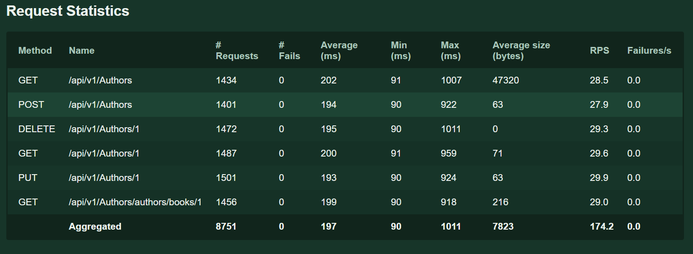
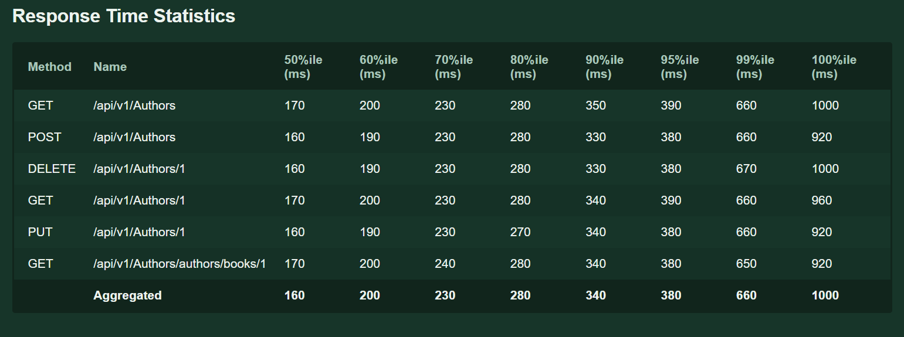
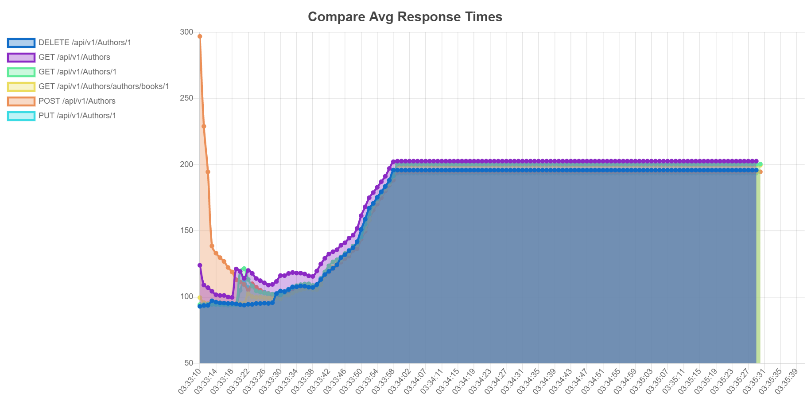

High Level Overview
---

* Performance Benchmarking Tool Used : **Locust**
* Programming Language : **Python**
* TestSuites : **authors_locust.py**
  * Using **HTTPUser** class to execute all the tests
  * using a **TaskSet** to create a collection of all the endpoints which need to be tested
  * using a **LoadTestShape** class to achieve the desired load pattern
  * using **--html** to capture the locust report
  * using **locust-reporter** plugin to capture detailed graphical report
* **runLocust.bat** : to execute locust tests
* [Performance Benchmarking Report](https://github.com/dchourasia/Automation-Performance/tree/main/Performance_Benchmarking/reports): in **reports** folder
* **Performance Results**
  * All the APIs seems to perform quite similar since these are fake APIs
  * RPS is low (around 30 for each API) since 100 users are distributed across all endpoints
  * All the APIs are doing quite well in terms of timing with 100 users in parallel
  * max 90%ile response time is 350ms and 99%ile time is 670ms which is very good for 100 user test
  * network latency is quite good, since it is not causing any additional network-time, though all the APIs have different request-size
  * Below are the screenshots of all the reports

